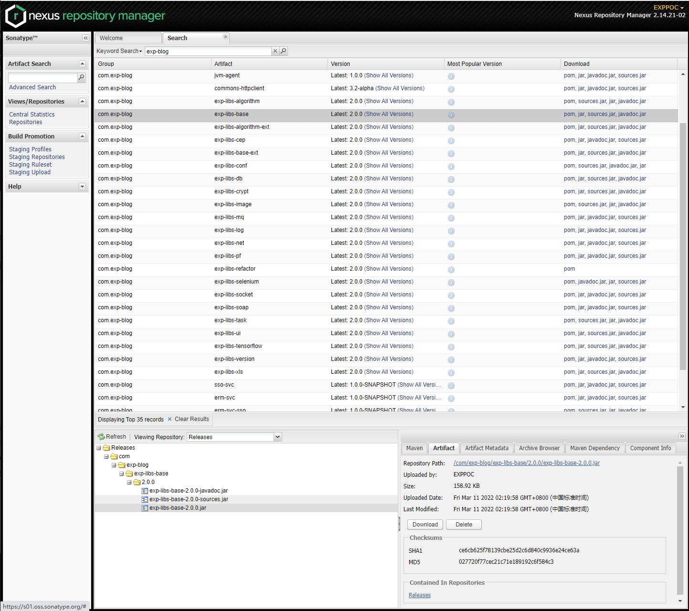

# 开发指引

------

## 发版规约

1. 从 master 检出 `[版本分支]`: `git checkout -b v${x.y.z}`
2. 修改 `pom.xml` 中的 `<version>`: 版本号 `+1`， 末尾增加 `-SNAPSHOT` 快照标识， push `[版本分支]` 到 Github
3. 从 `[版本分支]` 检出 `[特性分支]`: `git checkout -b feature-${xxx}`
4. 在 `[特性分支]` 修改代码（可以随时提交到 Github）
5. 每完成一个需求修改后，在 Github 合并 `[特性分支]` 到 `[版本分支]`，此时会触发流水线自动 deploy `SNAPSHOT` 版本到 Maven 中央仓库
6. 重复步骤 4 ~ 5， 直到一个版本需求完成
7. 宣布封版，在 Github 删除所有 `[特性分支]`
8. 在本地切换到 `[版本分支]`: `git checkout v${x.y.z}`
9. 拉取 `[版本分支]` 最新代码
10. 修改 `pom.xml` 中的 `<version>`: 移除末尾的 `-SNAPSHOT` 快照标识
11. 提交 `[版本分支]` 到 Github
12. 在 Github 对 `[版本分支]` 发起 `Releases` 动作（会要求新建 `Tag`，名称和 `[版本分支]` 名一致），此时会触发流水线自动 deploy `Release` 版本到 Maven 中央仓库
13. 在 Github 合并 `[版本分支]` 到 master，此时会触发流水线自动生成 javadoc
14. 重复步骤 1， 进入下一轮迭代

<b>发布流程示意图</b>

 

Note left of 视觉 AI 服务: Socket Server
loop Listener
视觉 AI 服务->>视觉 AI 服务: 监听游戏控制终端链接请求
end
Note right of 游戏控制终端: Socket Client
游戏控制终端->>视觉 AI 服务: 建立 Socket 连接
Note right of 游戏控制终端: 👇 Alt
游戏控制终端->>游戏: 截取游戏画面 中心区域
Note right of 游戏控制终端: by [OpenCV]
Note left of 游戏控制终端: by [视频采集卡]
游戏控制终端->>视觉 AI 服务: 发送区域图像
视觉 AI 服务->>视觉 AI 服务: 分析区域图像 获得人体部位坐标
Note left of 视觉 AI 服务: by [视觉 AI]
Note right of 视觉 AI 服务: by [Socket]
视觉 AI 服务->>游戏控制终端: 发送人体部位坐标
游戏控制终端->>游戏控制终端: 计算坐标偏移 获得鼠标坐标
Note right of 游戏控制终端: by [驱动级信号]
游戏控制终端->>游戏: 发送鼠标坐标
Note right of 游戏: 移动鼠标到目标 然后射击吧 !!!

## 发布位置

在 [pom.xml](./pom.xml) 中 `<distributionManagement>` 指定版本的发布目标位置是 [sonatype nexus](https://s01.oss.sonatype.org/)。

检索关键字 `exp-blog` 可检索到本工程的[所有依赖构件](https://s01.oss.sonatype.org/#nexus-search;quick~exp-blog)：

> 用在 [sonatype jira](https://issues.sonatype.org) 注册的账号即可登录 [sonatype nexus](https://s01.oss.sonatype.org/)。

