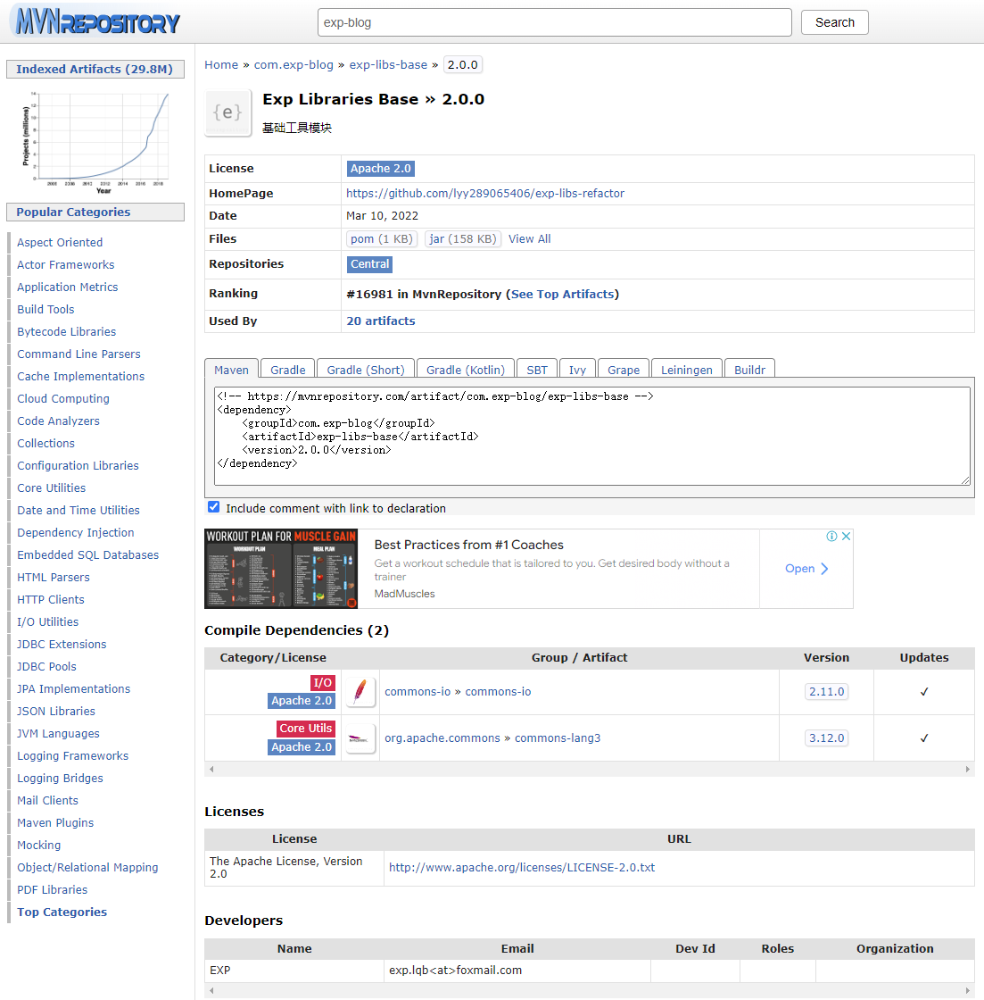

# exp-libs-refactor

> 经验构件库（重构版）

------

## 运行环境

[](https://www.oracle.com/java/technologies/javase/javase8-archive-downloads.html) [](https://maven.apache.org/) [](https://www.jetbrains.com/zh-cn/idea/)  


## 简介

此构件库为本人多年编程总结提炼而成，把常用的功能模块作为原子 API 进行封装。

另外也借用了不少出色的第三方构件，在其之上进行二次封装。

过程中尽量确保了低耦合、高性能、强稳健、高复用、更易用等，使之能够满足日常开发需要、提高开发效率。

> 原项目已废弃：https://github.com/lyy289065406/exp-libs


## 使用

### settings 仓库配置

在 `~/.m2/settings.xml` 追加 sonatype 中央仓库配置（本项目发布到该中央仓库）：

```xml
<mirror>
    <id>mvnrepository</id>
    <mirrorOf>mvnrepository</mirrorOf>
    <url>http://mvnrepository.com/</url>
</mirror>

<mirror>
    <id>sonatype</id>
    <mirrorOf>sonatype</mirrorOf>
    <url>https://s01.oss.sonatype.org/</url>
</mirror>
```


### 工程 pom 依赖配置

在你的工程 `pom.xml` 的 `<dependencies>` 下添加需要的依赖构件即可。

此项目的最新依赖的 pom 坐标可以到 [Maven 中央仓库](https://mvnrepository.com/search?q=exp-blog) 检索关键字 `exp-blog`。




### API 使用

本项目每个 API 均有完整的注释说明， 具体 API 的使用方法可查看 [Javadoc](https://lyy289065406.github.io/exp-libs-refactor/)
